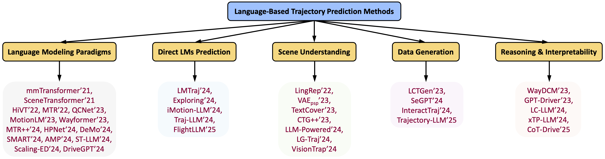

# Trajectory Prediction Meets Large Language Models: A Survey

**Yi Xu, Ruining Yang, Yitian Zhang, Yizhou Wang, Jianglin Lu, Mingyuan Zhang, Lili Su, Yun Fu**

*Department of Electrical and Computer Engineering, Northeastern University*  

📧 xu.yi@northeastern.edu 

---

## 📝 Overview

Recent advances in Large Language Models (LLMs) are transforming how autonomous systems understand, predict, and reason about motion. This survey offers the first comprehensive review of **LLM-based trajectory prediction**, highlighting how natural language can enhance modeling, supervision, interpretability, and simulation in trajectory prediction.

📄 **[Click here to view the full PDF](./LLM_Traj_Survey.pdf)**

---

## 📚 Taxonomy of LLM-based Methods
<div align="center">
  
</div>

We categorize current research into **five key directions**:

1. **Trajectory Prediction via Language Modeling Paradigms**  
   Reformulating trajectory generation as a language-style sequence modeling task using tokenization and autoregressive prediction.

2. **Direct Trajectory Prediction with Pretrained Language Models**  
   Employing GPT-style models (e.g., T5, GPT-3.5, LLaMA) directly to predict motion trajectories through prompting or fine-tuning.

3. **Language-Guided Scene Understanding for Trajectory Prediction**  
   Using natural language to enrich environmental understanding and support context-aware forecasting.

4. **Language-Driven Data Generation for Trajectory Prediction**  
   Generating synthetic trajectory data or driving scenarios from textual descriptions using LLMs.

5. **Language-Based Reasoning and Interpretability for Trajectory Prediction**  
   Providing natural language rationales, decision chains, and planning justifications to improve transparency and trust.


---

## 🔍 Motivation

> “Language is inherently expressive and compositional, LLMs offer a powerful tool for capturing context, goals, and intent in dynamic environments.”

This work bridges NLP and trajectory prediction communities, showcasing how LLMs support reasoning, few-shot generalization, and multimodal integration in dynamic, agent-based scenarios.

---

## 🚧 Challenges & Future Directions

We discuss several open challenges and promising directions, including:

- **Effective tokenization** of continuous motion data
- **Prompt design and alignment** across tasks
- **Commonsense and causal reasoning** with LLMs
- **Multimodal context fusion** (e.g., maps, images, language)
- **Explanation fidelity** and interpretability for real-world deployment

---

## 📊 Comparative Tables

We also provide structured comparisons of recent LLM-based methods across four core tasks:
- Direct Prediction
- Scene Understanding
- Data Generation
- Reasoning & Interpretability

Each table includes model types, LLM usage, prompting strategy, fine-tuning method, and datasets.

---

## 📁 Citation

Please cite our work if you find it helpful:
```bibtex
@misc{xu2025llmtraj,
  title={Trajectory Prediction Meets Large Language Models: A Survey},
  author={Yi Xu and Ruining Yang and Yitian Zhang and Yizhou Wang and Jianglin Lu and Mingyuan Zhang and Lili Su and Yun Fu},
  year={2025},
  url={https://github.com/colorfulfuture/Awesome-Trajectory-Motion-Prediction-Papers}
}
